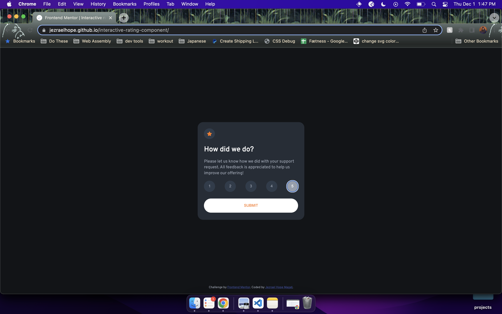

# Frontend Mentor - Interactive rating component solution

This is a solution to the [Interactive rating component challenge on Frontend Mentor](https://www.frontendmentor.io/challenges/interactive-rating-component-koxpeBUmI). Frontend Mentor challenges help you improve your coding skills by building realistic projects. 

## Table of contents

- [Overview](#overview)
  - [The challenge](#the-challenge)
  - [Screenshot](#screenshot)
  - [Links](#links)
- [My process](#my-process)
  - [Built with](#built-with)
  - [What I learned](#what-i-learned)
  - [Continued development](#continued-development)
  - [Useful resources](#useful-resources)
- [Author](#author)
- [Acknowledgments](#acknowledgments)

## Overview

### The challenge

Users should be able to:

- View the optimal layout for the app depending on their device's screen size
- See hover states for all interactive elements on the page
- Select and submit a number rating
- See the "Thank you" card state after submitting a rating

### Screenshot



### Links

- Solution URL: [Add solution URL here](https://github.com/jezraelhope/interactive-rating-component)
- Live Site URL: [Add live site URL here](https://jezraelhope.github.io/interactive-rating-component/)

## My process

### Built with

- Semantic HTML5 markup
- CSS custom properties
- Flexbox
- Mobile-first workflow
- DOM Manipulation
- JavaScript


### What I learned

This challenge was a great refresher for me on DOM manipulation. In the past year, I have only been coding with react, so I have forgotten the basics of manipulating the DOM. I definitely enjoyed coding this challenge and I'm looking forward to the next one.

I have also learned how to use the psudo class, focus. While it was fun relearning DOM manipulation again, I struggled to figure out how to change the number rating buttons' styles after clicking and removing that styling after a sibling element was clicked in JavaScript. I then eventually learned that I can just use the focus pseudo class.

```
.btn:focus {
    background-color: hsl(217, 12%, 63%);
    color: hsl(0, 0%, 100%);
}
```

### Continued development

I learned a lot in this challenge but what I am looking forward to the most is feedback that I will receive on frontendmentor. I am sure that there is a better way in solving this project out there and I can't wait to find out if I did alright, specially in my choice to just hide the ratings-container after hitting submit. :see_no_evil:


### Useful resources

- [JavaScript DOM Manipulation – Full Course for Beginners](https://www.youtube.com/watch?v=5fb2aPlgoys&t=5s) - Prior to creating this project, I have watched this video first and was able to learn DOM Manipulation again.


## Author

- Website - [Jezrael Hope Magat](https://jezraelhope.onrender.com/)
- Frontend Mentor - [@jezraelhope](https://www.frontendmentor.io/profile/jezraelhope)
- Twitter - [@jezraelhope](https://www.twitter.com/yourusername)